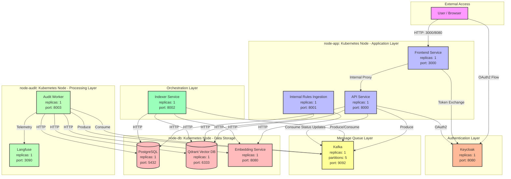

# SecureRepo Deployment Diagram

## Architecture Overview

### Node Distribution

| Node | Purpose | Services | Node Selector |
|------|---------|----------|---------------|
| **node-app** | Application Layer | Frontend, API, Internal Rules Ingestion | `node: node-app` |
| **node-audit** | Processing Layer | Audit Worker, Langfuse | `node: node-audit` |
| **node-db** | Data Storage | PostgreSQL, Qdrant, Embedding Service | `node: node-db` |

### Service Details

#### Application Layer (node-app)

- **Frontend Service** (replicas: 1)
  - Port: 3000
  - Purpose: User interface, OAuth2 client
  - Dependencies: API Service, Keycloak

- **API Service** (replicas: 1)
  - Port: 8000
  - Purpose: REST API, audit orchestration
  - Dependencies: PostgreSQL, Qdrant, Kafka, Keycloak
  - Kafka Topics:
    - `repo_parsed`: 5 partitions (produce with audit_id key)
    - `audit_status`: 1 partition (consume status updates)

- **Internal Rules Ingestion** (replicas: 1)
  - Port: 8001
  - Purpose: Ingest security rules into vector DB
  - Dependencies: Qdrant, Embedding Service

#### Processing Layer (node-audit)

- **Audit Worker** (replicas: 1, scalable to 5)
  - Port: 8003
  - Purpose: Process audit tasks with LLM
  - Dependencies: Kafka, PostgreSQL, Qdrant, Embedding Service, Langfuse
  - Kafka Topics:
    - `audit_tasks`: 5 partitions (consume with audit_id key)
    - `audit_status`: 1 partition (produce status updates)
  - LLM: qwen2.5-coder-7b-instruct via Ollama

- **Langfuse** (replicas: 1)
  - Port: 3090
  - Purpose: LLM observability & tracing
  - Internal use only

#### Data Storage Layer (node-db)

- **PostgreSQL** (replicas: 1)
  - Port: 5432
  - Persistence: 4Gi PVC
  - Data: Users, audits, results

- **Qdrant** (replicas: 1)
  - Port: 6333 (HTTP), 6334 (gRPC)
  - Persistence: 4Gi PVC
  - Purpose: Vector store for code chunks & rules

- **Embedding Service** (replicas: 1)
  - Port: 8080
  - Model: BAAI/bge-m3
  - Purpose: Generate embeddings for code/rules

#### Message Queue Layer

- **Kafka** (replicas: 1)
  - Port: 9092 (PLAINTEXT), 9093 (CONTROLLER)
  - Persistence: 2Gi PVC
  - Topics:
    - `repo_parsed`: 5 partitions
    - `audit_tasks`: 5 partitions
    - `audit_status`: 1 partition
  - Partitioning: audit_id as message key for ordering

#### Authentication Layer

- **Keycloak** (replicas: 1)
  - Port: 8080
  - Persistence: 2Gi PVC
  - Purpose: OAuth2 / OpenID Connect provider
  - Realm: securerepo

#### Orchestration Layer

- **Indexer Service** (replicas: 1)
  - Port: 8002
  - Purpose: Parse repo, create chunks, send to Kafka
  - Dependencies: Kafka, PostgreSQL, Qdrant, Embedding Service

### Data Flow

1. **User starts audit** → Frontend → API (authenticated via Keycloak)
2. **API** sends to Kafka topic `repo_parsed` (key: audit_id)
3. **Indexer** consumes from `repo_parsed`, parses repo, creates chunks
4. **Indexer** sends chunks to `audit_tasks` (key: audit_id)
5. **Audit Worker** consumes from `audit_tasks` (one worker per audit_id)
6. **Audit Worker** searches Qdrant for relevant rules
7. **Audit Worker** calls LLM for security analysis
8. **Audit Worker** sends results to PostgreSQL
9. **Audit Worker** publishes status to `audit_status`
10. **API** consumes status updates → Frontend shows progress

### Horizontal Scaling

- **Audit Workers**: Can scale to 5 replicas (one per partition)
  - Each audit's chunks stay on same partition (audit_id key)
  - Different audits can be processed in parallel
- **API Service**: Stateless, can scale with replicas
- **Frontend**: Stateless, can scale with replicas
- **Database/Data Services**: Stateful, single replicas (vertical scaling only)

### Storage Requirements

| Service | PVC Size | Purpose |
|---------|----------|---------|
| PostgreSQL | 4Gi | Audit data, user records |
| Qdrant | 4Gi | Vector embeddings |
| Kafka | 2Gi | Message logs (7 days retention) |
| Keycloak | 2Gi | User database, sessions |

### Network Ports

| Service | Internal Port | External Access |
|---------|---------------|-----------------|
| Frontend | 3000 | Ingress: 80 |
| API | 8000 | ClusterIP only |
| Audit Worker | 8003 | ClusterIP only |
| Indexer | 8002 | ClusterIP only |
| Rules Ingestion | 8001 | ClusterIP only |
| PostgreSQL | 5432 | ClusterIP only |
| Qdrant | 6333/6334 | ClusterIP only |
| Kafka | 9092/9093 | ClusterIP only |
| Keycloak | 8080 | ClusterIP only |
| Langfuse | 3090 | ClusterIP only |
| Embedding | 8080 | ClusterIP only |
