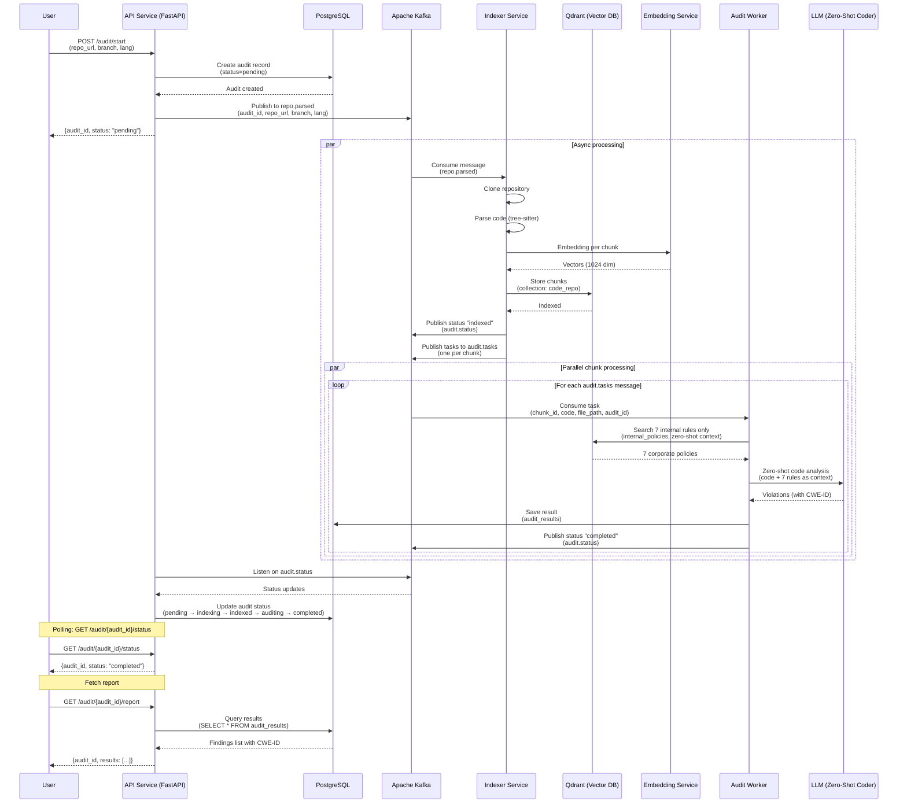

# Audit start sequence

> 🇷🇺 [Russian version](../../ru/architecture/audit-start-sequence.md)

```mermaid
sequenceDiagram
    participant User as User
    participant API as API Service (FastAPI)
    participant SQL as PostgreSQL
    participant Kafka as Apache Kafka
    participant Indexer as Indexer Service
    participant Qdrant as Qdrant (Vector DB)
    participant Embed as Embedding Service
    participant Worker as Audit Worker
    participant LLM as LLM (Zero-Shot Coder)

    User->>API: POST /audit/start<br/>(repo_url, branch, lang)
    API->>SQL: Create audit record<br/>(status=pending)
    SQL-->>API: Audit created
    API->>Kafka: Publish to repo.parsed<br/>(audit_id, repo_url, branch, lang)
    API-->>User: {audit_id, status: "pending"}

    par Async processing
        Kafka->>Indexer: Consume message<br/>(repo.parsed)
        Indexer->>Indexer: Clone repository
        Indexer->>Indexer: Parse code (tree-sitter)
        Indexer->>Embed: Embedding per chunk
        Embed-->>Indexer: Vectors (1024 dim)
        Indexer->>Qdrant: Store chunks<br/>(collection: code_repo)
        Qdrant-->>Indexer: Indexed
        Indexer->>Kafka: Publish status "indexed"<br/>(audit.status)
        Indexer->>Kafka: Publish tasks to audit.tasks<br/>(one per chunk)

        par Parallel chunk processing
            loop For each audit.tasks message
                Kafka->>Worker: Consume task<br/>(chunk_id, code, file_path, audit_id)
                Worker->>Qdrant: Search 7 internal rules only<br/>(internal_policies, zero-shot context)
                Qdrant-->>Worker: 7 corporate policies
                Worker->>LLM: Zero-shot code analysis<br/>(code + 7 rules as context)
                LLM-->>Worker: Violations (with CWE-ID)
                Worker->>SQL: Save result<br/>(audit_results)
                Worker->>Kafka: Publish status "completed"<br/>(audit.status)
            end
        end
    end

    API->>Kafka: Listen on audit.status
    Kafka-->>API: Status updates
    API->>SQL: Update audit status<br/>(pending → indexing → indexed → auditing → completed)

    Note over User,API: Polling: GET /audit/{audit_id}/status
    User->>API: GET /audit/{audit_id}/status
    API-->>User: {audit_id, status: "completed"}

    Note over User,API: Fetch report
    User->>API: GET /audit/{audit_id}/report
    API->>SQL: Query results<br/>(SELECT * FROM audit_results)
    SQL-->>API: Findings list with CWE-ID
    API-->>User: {audit_id, results: [...]}
```
